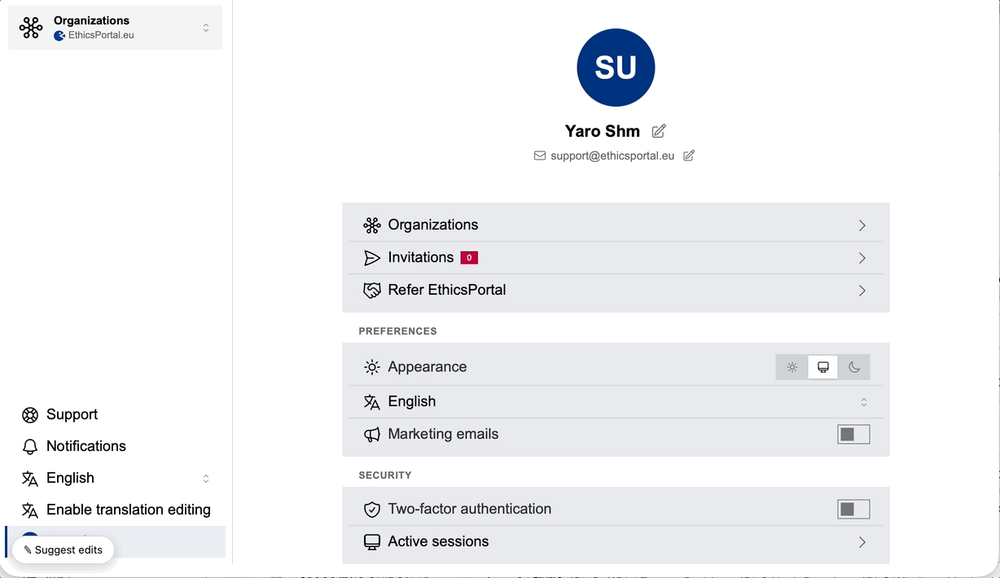

# i18n_feedback

[](https://rubygems.org/gems/i18n_feedback)
[](https://rubygems.org/gems/i18n_feedback)
[](https://github.com/yshmarov/i18n-feedback/actions/workflows/ci.yml)
[](MIT-LICENSE)

In-context translation proofreading for Rails.

`i18n_feedback` renders every translated string alongside its i18n key in the
environments you choose, lets a reviewer click any string in the running app and
suggest a better wording, and stores those suggestions for a developer to apply.
It is meant for development and staging, never production.



<video src="https://github.com/yshmarov/i18n-feedback/raw/main/i18n-feedback-demo-640-high.mp4" controls muted playsinline width="640">
  Your browser can't play this video —
  <a href="https://github.com/yshmarov/i18n-feedback/raw/main/i18n-feedback-demo-640-high.mp4">download it here</a>.
</video>

- **Zero UI dependencies.** The widget is plain JavaScript and styles itself. No
  Tailwind, no daisyUI, no Stimulus, no importmap, no build step.
- **Zero layout changes.** The widget is injected into HTML responses
  automatically (opt out and place it yourself if you prefer).
- **Trigger it your way.** Use the built-in floating pill, or hide it and switch
  suggest mode on from your own link (a nav item, a menu, anywhere).
- **Pluggable gating and attribution.** You decide which environments and which
  users see the tool, and how a suggestion is attributed.

## How it works

1. In an enabled environment, the I18n backend appends a hidden `some.key`
   marker to each translated string. Markers are only emitted while a reviewer
   has the tool switched on (a cookie), so pages are clean by default.
2. The browser widget strips every marker out of the DOM on load and remembers
   which key produced each piece of text.
3. Clicking a string opens a popover showing the current text, any pending
   suggestions, and a field to propose a new wording.
4. Suggestions are `POST`ed to the mounted engine and stored in the
   `i18n_feedback_suggestions` table for you to review and apply.

## Turbo

Works with Turbo Drive out of the box. Turbo replaces `<body>` on every visit,
which would take the pill and the active-mode highlighting with it, so the
widget registers its document-level listeners once and re-renders on
`turbo:load`. The pill survives navigation without a full reload.

## Requirements

- Ruby >= 3.2
- Rails >= 7.1

## Installation

Add the gem:

```ruby
# Gemfile
gem "i18n_feedback"
```

```bash
bundle install
bin/rails generate i18n_feedback:install
bin/rails db:migrate
```

The generator:

- writes `config/initializers/i18n_feedback.rb`,
- creates the `i18n_feedback_suggestions` migration,
- mounts the engine in `config/routes.rb`:

  ```ruby
  mount I18nFeedback::Engine => "/i18n_feedback"
  ```

Boot the app in development and look for the **“Suggest edits”** pill in the
bottom-left corner. Click it to turn on suggest mode, then click any text to
propose a fix. Press `Esc` (or the pill) to exit.

> The widget reads the CSRF token from `<meta name="csrf-token">`, which
> `csrf_meta_tags` in your layout already provides in a standard Rails app.

## Configuration

Everything is optional; the defaults work out of the box in development.

```ruby
# config/initializers/i18n_feedback.rb
I18nFeedback.configure do |config|
  # Environments the tool is active in.
  config.enabled_environments = %w[development staging]

  # Extra per-request gate. Return false to hide the tool. Receives the request.
  config.enabled = ->(request) { true }

  # Attribute a suggestion to a user (optional). Return an object responding to
  # #id, or nil. Receives the request.
  config.current_user = ->(request) { nil }

  # Label shown for the author in the "already suggested" list.
  config.author_label = ->(user) { user.try(:email) }

  # Inject the widget automatically. Set false to place it yourself.
  config.auto_inject = true

  # Show the floating "Suggest edits" pill. Set false to drive suggest mode from
  # your own link instead (see below).
  config.show_pill = true

  # Query parameter that toggles suggest mode.
  config.toggle_param = "i18n_feedback"

  # Keep in sync with the `mount` in config/routes.rb.
  config.mount_path = "/i18n_feedback"

  # Per-IP throttle on the submission endpoint, passed to Rails' built-in rate
  # limiter (Rails 7.2+; ignored on 7.1). Set nil to disable.
  config.rate_limit = { to: 30, within: 60 }
end
```

### Toggling suggest mode from your own link

Prefer a menu item over the floating pill? You can drive suggest mode from any
link in your own UI — a nav item, a sidebar entry, a footer — and optionally hide
the pill (the two can also coexist):

```ruby
config.show_pill = false # optional
```

A one-way "turn it on" link is just the toggle parameter:

```erb
<%= link_to "Proofread translations", "?i18n_feedback=true" %>
```

For a single control that flips both ways, read the current state from the
`i18n_feedback` cookie and point at the opposite state:

```erb
<% on = cookies[:i18n_feedback].present? %>
<%= link_to (on ? "Disable translations editing" : "Enable translations editing"),
            "?i18n_feedback=#{!on}" %>
```

Good to know:

- `?i18n_feedback=true` turns suggest mode on, `false` turns it off. The state is
  stored in the `i18n_feedback` cookie, and the middleware then redirects to the
  same URL without the parameter — so it never sticks in the address bar and the
  cookie stays the single source of truth. `Esc` (or the pill) also exits.
- These links keep working **while suggest mode is active**. The widget freezes
  ordinary navigation during proofreading (so a stray click can't leave the page
  mid-edit), but any link carrying the toggle parameter is exempt — so a "Disable"
  item in your nav always gets you out.
- **Don't** run the label through `I18n.t`: the tool would then mark its own
  control as an editable string. Keep the label a plain literal.

### Gating examples

```ruby
# Only signed-in staff (however your app resolves that):
config.enabled = ->(request) { request.env["warden"]&.user&.staff? }

# Behind a feature flag:
config.enabled = ->(request) { Flipper.enabled?(:i18n_feedback) }
```

### Placing the widget yourself

Set `config.auto_inject = false` and drop the helper at the end of your layout:

```erb
<%= i18n_feedback_tag %>
```

It renders nothing unless the tool is available for the request.

### Localizing the widget UI

The pill and the suggestion popover speak the app's language: every string
resolves through Rails I18n under the `i18n_feedback.*` scope and follows the
language the page was rendered in (its `<html lang>`, falling back to
`I18n.locale`). Translations ship out of the box for English plus 20 more
languages — Arabic, Bengali, Chinese (Simplified), Dutch, French, German, Hindi,
Indonesian, Italian, Japanese, Korean, Polish, Portuguese, Russian, Spanish,
Thai, Turkish, Ukrainian, Urdu and Vietnamese — so the tool is already localized
for most apps. RTL locales (Arabic, Urdu, …) render the popover right-to-left
automatically.

Any key you haven't translated falls back to English, so a partially translated
locale never leaves a control blank. To add a language, or reword the bundled
copy, define the keys in your own locale files (yours win over the gem's):

```yaml
# config/locales/fr.yml
fr:
  i18n_feedback:
    pill: "Proposer des corrections"
    pill_active: "En cours — appuyez pour quitter (Échap)"
    title: "Proposer une correction de traduction"
    current_text: "Texte actuel"
    suggested_text: "Texte proposé"
    comment: "Commentaire"
    comment_placeholder: "Note facultative pour le développeur"
    prior_title: "Déjà proposé (en attente)"
    cancel: "Annuler"
    save: "Envoyer la suggestion"
    error_blank: "Veuillez saisir une suggestion."
    error_save: "Impossible d'enregistrer la suggestion."
```

`config.pill_label` still overrides the pill text with a fixed string if you set
it; leave it `nil` (the default) to use the localized `i18n_feedback.pill` key.

### Light / dark / system appearance

The widget follows the reviewer's operating-system appearance via
`prefers-color-scheme` — no configuration needed. The pill and popover render on a
dark surface when the system is in dark mode and a light surface otherwise; the
blue accent stays the same in both.

## Reviewing suggestions

Suggestions are ordinary records:

```ruby
I18nFeedback::Suggestion.where(status: "pending").newest_first.each do |s|
  puts "#{s.locale} #{s.translation_key}: #{s.old_value.inspect} -> #{s.proposed_value.inspect}"
end
```

Each row stores `translation_key`, `locale`, `old_value`, `proposed_value`,
`comment`, `page_url`, `status`, and optional `author_id` / `author_label`.

Every suggestion has a `status` — one of `pending`, `applied`, or `rejected`
(`I18nFeedback::Suggestion::STATUSES`), backed by an Active Record enum. New
suggestions start `pending`; once you apply a wording to your locale files or
decide against it, set the status accordingly so the popover stops offering it
as pending context:

```ruby
suggestion.status_applied!          # bang setter
suggestion.status_applied?          # => true
I18nFeedback::Suggestion.status_pending.newest_first  # scope per status
```

### Getting notified

To be pinged when a suggestion comes in, set `on_submit`. It's called with the
saved `Suggestion` right after it's stored — notify Slack, send an email, open a
ticket. It runs inline in the request, so keep it fast or hand off to a job:

```ruby
config.on_submit = ->(suggestion) { SuggestionMailer.with(suggestion:).created.deliver_later }
```

## Security

- The tool is gated **on the server** for every marker, endpoint, and injection.
  Setting the cookie by hand does nothing outside an enabled environment where
  `config.enabled` returns true.
- Format and lookup namespaces (`number.*`, `date.*`, `*_html` formats, etc.) are
  never marked, so currency and date formatting are unaffected.
- The injected widget code carries the request's Content-Security-Policy nonce
  (the same one `ActionDispatch` emits), so it runs under a nonce-based
  `script-src` policy — including `strict-dynamic` — with no configuration. It is
  a no-op when the app sets no CSP nonce. The runtime config is shipped as a
  `<script type="application/json">` block (data, not code), so it needs no nonce
  and stays correct across Turbo visits.

## Development

```bash
bin/setup        # or: bundle install
bundle exec rspec
```

Tests run against a dummy Rails app under `spec/dummy`.

## License

Released under the [MIT License](MIT-LICENSE).
